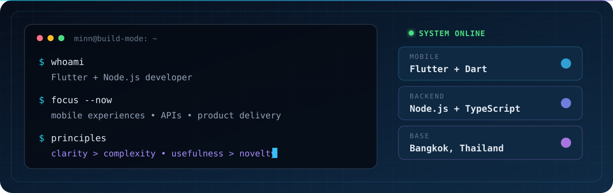

  

<h1 align="center">MINN KHANT THU</h1>

  

  <b>Flutter &amp; Node.js Developer</b> · Bangkok, Thailand · <a href="https://github.com/Joy-Groups-International">Joy Groups International</a>

  
  
  

## 🧬 Engineering DNA

> From the **first tap** to the **final response**, I work across UI, state, APIs, data contracts, and delivery.

<table>
  <tr>
    <td width="33%" align="center">
      <h3>📱 Mobile craft</h3>
      
Flutter experiences that feel fast, clear, and intentional—not just screens that happen to work.

    </td>
    <td width="33%" align="center">
      <h3>⚙️ Backend systems</h3>
      
Practical APIs, clean data flows, and dependable services built with Node.js and TypeScript.

    </td>
    <td width="33%" align="center">
      <h3>🚀 Product delivery</h3>
      
Turning ambiguous ideas into maintainable features that are ready to ship and easy to evolve.

    </td>
  </tr>
</table>

## 🧰 Toolbelt

  

  <code>Flutter</code> · <code>Dart</code> · <code>TypeScript</code> · <code>Node.js</code> · <code>NestJS</code> · <code>Express</code> 
  <code>PostgreSQL</code> · <code>Prisma</code> · <code>MongoDB</code> · <code>Redis</code> · <code>GitHub Actions</code>

## ⚡ Build mode

  

## 🐍 Contribution trail

  <picture>
    <source media="(prefers-color-scheme: dark)" srcset="./assets/generated/contribution-snake-dark.svg" />
    <source media="(prefers-color-scheme: light)" srcset="./assets/generated/contribution-snake-light.svg" />
    
  </picture>

  Regenerated automatically by GitHub Actions so the trail keeps moving.

## 🤝 Let's build something people enjoy using

  <b>Good software should feel simple—even when the system behind it isn't.</b> 
  Building a mobile product or an API-heavy workflow? Let's connect.

  
  

  From pixels to APIs · Built with curiosity in Bangkok

