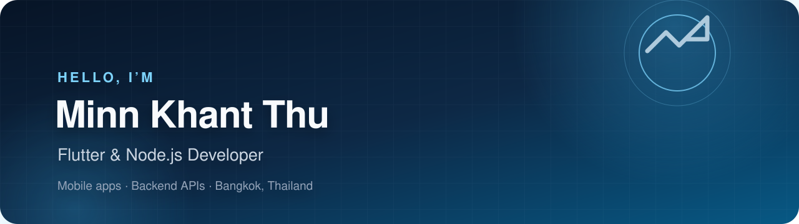

  

  
  
  

## Hello, I'm Minn 👋

I'm a **Flutter & Node.js Developer** at [Joy Groups International](https://github.com/Joy-Groups-International), based in Bangkok, Thailand.

I enjoy turning product ideas into polished mobile experiences and dependable backend services—from clean Flutter interfaces to practical APIs and data flows.

- 📱 Building cross-platform mobile apps with **Flutter & Dart**
- ⚙️ Developing backend services with **Node.js, TypeScript & Express**
- 🧩 Interested in maintainable architecture, smooth UX, and reliable delivery
- 🤝 Open to connecting with developers and product builders

## Tech I work with

  
  
  
  
  
  
  
  

  Thanks for stopping by. Have a look around, or reach out and say hello.

